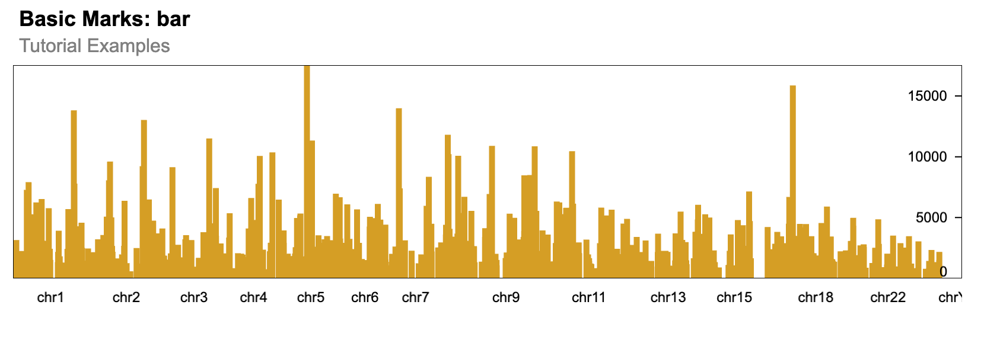

# 2. Using a GRanges object in shiny.gosling

## Call required libraries.

``` r
require(shiny.gosling)
#> Warning in fun(libname, pkgname): Package 'shiny.gosling' is deprecated and will be removed from
#>   Bioconductor version 3.24
require(shiny)
require(GenomicRanges)
```

## Getting a sample data for the GRanges object

We will be loading the peaks data from ChipSeq dataset with the GEO
accession
[GSM1295076](https://www.ncbi.nlm.nih.gov/geo/query/acc.cgi?acc=GSM1295076)

`GSM1295076_CBX6_BF_ChipSeq_mergedReps_peaks.bed.gz` file will be used
to create a sample GRanges object.

``` r
url <- paste0(
  "https://www.ncbi.nlm.nih.gov/geo/download/",
  "?acc=GSM1295076&format=file&file=GSM1295076_CBX6_BF_ChipSeq_mergedReps_peaks.bed.gz"
)
temp_file <- file.path(tempdir(), "data.gz")
download.file(url, destfile = temp_file, method = "auto", mode = "wb")
df <- read.delim(
  temp_file,
  header = FALSE,
  comment.char = "#",
  sep = ""
)
gr <- GRanges(
  seqnames = df$V1,
  ranges = IRanges(df$V2, df$V3)
)
gr
#> GRanges object with 1331 ranges and 0 metadata columns:
#>          seqnames              ranges strand
#>             <Rle>           <IRanges>  <Rle>
#>      [1]     chr1       815092-817883      *
#>      [2]     chr1     1243287-1244338      *
#>      [3]     chr1     2979976-2981228      *
#>      [4]     chr1     3566181-3567876      *
#>      [5]     chr1     3816545-3818111      *
#>      ...      ...                 ...    ...
#>   [1327]     chrX 135244782-135245821      *
#>   [1328]     chrX 139171963-139173506      *
#>   [1329]     chrX 139583953-139586126      *
#>   [1330]     chrX 139592001-139593238      *
#>   [1331]     chrY   13845133-13845777      *
#>   -------
#>   seqinfo: 24 sequences from an unspecified genome; no seqlengths
```

## Using the GRanges object for a plot using shiny.gosling

### Method 1 - Using the `track_data_gr` function

You can use the `track_data_gr` to pass the `GRanges` object inside a
track.

Note: Make sure to run the Shiny app using the
[`shiny::runApp()`](https://rdrr.io/pkg/shiny/man/runApp.html) rather
than interactively running the
[`shiny::shinyApp()`](https://rdrr.io/pkg/shiny/man/shinyApp.html)
object.

``` r

ui <- fluidPage(
  use_gosling(clear_files = FALSE),
  goslingOutput("gosling_plot")
)

track_1 <- add_single_track(
  width = 800,
  height = 180,
  data = track_data_gr(
    gr, chromosomeField = "seqnames",
    genomicFields = c("start", "end")
  ),
  mark = "bar",
  x = visual_channel_x(
    field = "start", type = "genomic", axis = "bottom"
  ),
  xe = visual_channel_x(field = "end", type = "genomic"),
  y = visual_channel_y(
    field = "width", type = "quantitative", axis = "right"
  ),
  size = list(value = 5)
)

composed_view <- compose_view(
  layout = "linear",
  tracks = track_1
)

arranged_view <- arrange_views(
  title = "Basic Marks: bar",
  subtitle = "Tutorial Examples",
  views = composed_view
)

server <- function(input, output, session) {
  output$gosling_plot <- renderGosling({
    gosling(
      component_id = "component_1",
      arranged_view
    )
  })
}

shiny::shinyApp(ui, server)
```

### Method 2 - Using the `track_data_csv` function

You can save the `GRanges` object as a `csv` file inside the www
directory which can be used in the shiny.gosling plot.

``` r
if (!dir.exists("data")) {
  dir.create("data")
}
utils::write.csv(gr, "data/ChipSeqPeaks.csv", row.names = FALSE)

track_1 <- add_single_track(
  width = 800,
  height = 180,
  data = track_data_csv(
    "data/ChipSeqPeaks.csv", chromosomeField = "seqnames",
    genomicFields = c("start", "end")
  ),
  mark = "bar",
  x = visual_channel_x(
    field = "start", type = "genomic", axis = "bottom"
  ),
  xe = visual_channel_x(field = "end", type = "genomic"),
  y = visual_channel_y(
    field = "width", type = "quantitative", axis = "right"
  ),
  size = list(value = 5)
)

composed_view <- compose_view(
  layout = "linear",
  tracks = track_1
)

arranged_view <- arrange_views(
  title = "Basic Marks: bar",
  subtitle = "Tutorial Examples",
  views = composed_view
)

shiny::shinyApp(ui = fluidPage(
  use_gosling(clear_files = FALSE),
  goslingOutput("gosling_plot")
), server = function(input, output, session) {
  output$gosling_plot <- renderGosling({
    gosling(
      component_id = "component_1",
      arranged_view
    )
  })
}, options = list(height = 1000))
```



## Session Info

``` r

sessionInfo()
#> R version 4.5.3 (2026-03-11)
#> Platform: x86_64-pc-linux-gnu
#> Running under: Ubuntu 24.04.4 LTS
#> 
#> Matrix products: default
#> BLAS:   /usr/lib/x86_64-linux-gnu/openblas-pthread/libblas.so.3 
#> LAPACK: /usr/lib/x86_64-linux-gnu/openblas-pthread/libopenblasp-r0.3.26.so;  LAPACK version 3.12.0
#> 
#> locale:
#>  [1] LC_CTYPE=C.UTF-8       LC_NUMERIC=C           LC_TIME=C.UTF-8       
#>  [4] LC_COLLATE=C.UTF-8     LC_MONETARY=C.UTF-8    LC_MESSAGES=C.UTF-8   
#>  [7] LC_PAPER=C.UTF-8       LC_NAME=C              LC_ADDRESS=C          
#> [10] LC_TELEPHONE=C         LC_MEASUREMENT=C.UTF-8 LC_IDENTIFICATION=C   
#> 
#> time zone: UTC
#> tzcode source: system (glibc)
#> 
#> attached base packages:
#> [1] stats4    stats     graphics  grDevices utils     datasets  methods  
#> [8] base     
#> 
#> other attached packages:
#> [1] GenomicRanges_1.62.1 Seqinfo_1.0.0        IRanges_2.44.0      
#> [4] S4Vectors_0.48.1     BiocGenerics_0.56.0  generics_0.1.4      
#> [7] shiny_1.13.0         shiny.gosling_1.7.2 
#> 
#> loaded via a namespace (and not attached):
#>  [1] jsonlite_2.0.0    compiler_4.5.3    promises_1.5.0    Rcpp_1.1.1-1     
#>  [5] later_1.4.8       jquerylib_0.1.4   systemfonts_1.3.2 textshaping_1.0.5
#>  [9] yaml_2.3.12       fastmap_1.2.0     mime_0.13         R6_2.6.1         
#> [13] knitr_1.51        htmlwidgets_1.6.4 desc_1.4.3        bslib_0.10.0     
#> [17] rlang_1.2.0       stringi_1.8.7     cachem_1.1.0      httpuv_1.6.17    
#> [21] xfun_0.57         fs_2.1.0          sass_0.4.10       shiny.react_0.4.0
#> [25] otel_0.2.0        cli_3.6.6         pkgdown_2.2.0     magrittr_2.0.5   
#> [29] digest_0.6.39     xtable_1.8-8      lifecycle_1.0.5   glue_1.8.1       
#> [33] evaluate_1.0.5    ragg_1.5.2        rmarkdown_2.31    tools_4.5.3      
#> [37] htmltools_0.5.9
```
