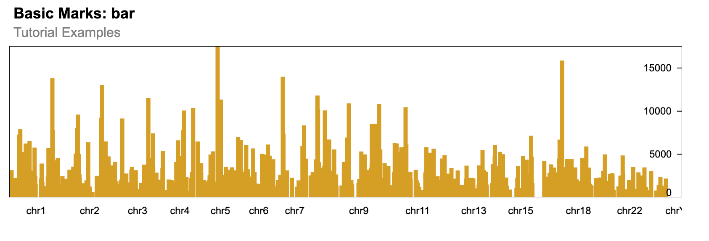

```{r, include=FALSE, eval=FALSE}
knitr::opts_chunk$set(
  collapse = TRUE,
  comment = "#>"
)
```

## Call required libraries.

```{r setup, message=FALSE, eval=FALSE}
require(shiny.gosling)
require(shiny)
require(GenomicRanges)
```

## Getting a sample data for the GRanges object

We will be loading the peaks data from ChipSeq dataset with the GEO accession [GSM1295076](https://www.ncbi.nlm.nih.gov/geo/query/acc.cgi?acc=GSM1295076)

`GSM1295076_CBX6_BF_ChipSeq_mergedReps_peaks.bed.gz` file will be used to create a sample GRanges object.

```{r, reading-data, eval=FALSE}
url <- "https://rb.gy/7y3fx"
temp_file <- file.path(tempdir(), "data.gz")
download.file(url, destfile = temp_file, method = "auto", mode = "wb")
df <- read.delim(
  temp_file,
  header = FALSE,
  comment.char = "#",
  sep = ""
)
gr <- GRanges(
  seqnames = df$V1,
  ranges = IRanges(df$V2, df$V3)
)
gr
```

## Using the GRanges object for a plot using shiny.gosling

### Method 1 - Using the `track_data_gr` function

You can use the `track_data_gr` to pass the `GRanges` object inside a track.

Note: Make sure to run the Shiny app using the `shiny::runApp()` rather than interactively running the `shiny::shinyApp()` object.

```{r, method-1, eval=FALSE, eval=FALSE}

ui <- fluidPage(
  use_gosling(clear_files = FALSE),
  goslingOutput("gosling_plot")
)

track_1 <- add_single_track(
  width = 800,
  height = 180,
  data = track_data_gr(
    gr, chromosomeField = "seqnames",
    genomicFields = c("start", "end")
  ),
  mark = "bar",
  x = visual_channel_x(
    field = "start", type = "genomic", axis = "bottom"
  ),
  xe = visual_channel_x(field = "end", type = "genomic"),
  y = visual_channel_y(
    field = "width", type = "quantitative", axis = "right"
  ),
  size = list(value = 5)
)

composed_view <- compose_view(
  layout = "linear",
  tracks = track_1
)

arranged_view <- arrange_views(
  title = "Basic Marks: bar",
  subtitle = "Tutorial Examples",
  views = composed_view
)

server <- function(input, output, session) {
  output$gosling_plot <- renderGosling({
    gosling(
      component_id = "component_1",
      arranged_view
    )
  })
}

shiny::shinyApp(ui, server)
```

### Method 2 - Using the `track_data_csv` function

You can save the `GRanges` object as a `csv` file inside the www directory which can be used in the shiny.gosling plot.

```{r, method-2, eval=FALSE}
if (!dir.exists("data")) {
  dir.create("data")
}
utils::write.csv(gr, "data/ChipSeqPeaks.csv", row.names = FALSE)

track_1 <- add_single_track(
  width = 800,
  height = 180,
  data = track_data_csv(
    "data/ChipSeqPeaks.csv", chromosomeField = "seqnames",
    genomicFields = c("start", "end")
  ),
  mark = "bar",
  x = visual_channel_x(
    field = "start", type = "genomic", axis = "bottom"
  ),
  xe = visual_channel_x(field = "end", type = "genomic"),
  y = visual_channel_y(
    field = "width", type = "quantitative", axis = "right"
  ),
  size = list(value = 5)
)

composed_view <- compose_view(
  layout = "linear",
  tracks = track_1
)

arranged_view <- arrange_views(
  title = "Basic Marks: bar",
  subtitle = "Tutorial Examples",
  views = composed_view
)

shiny::shinyApp(ui = fluidPage(
  use_gosling(clear_files = FALSE),
  goslingOutput("gosling_plot")
), server = function(input, output, session) {
  output$gosling_plot <- renderGosling({
    gosling(
      component_id = "component_1",
      arranged_view
    )
  })
}, options = list(height = 1000))
```

{width=500px}

## Session Info

```{r session_info}

sessionInfo()
```
