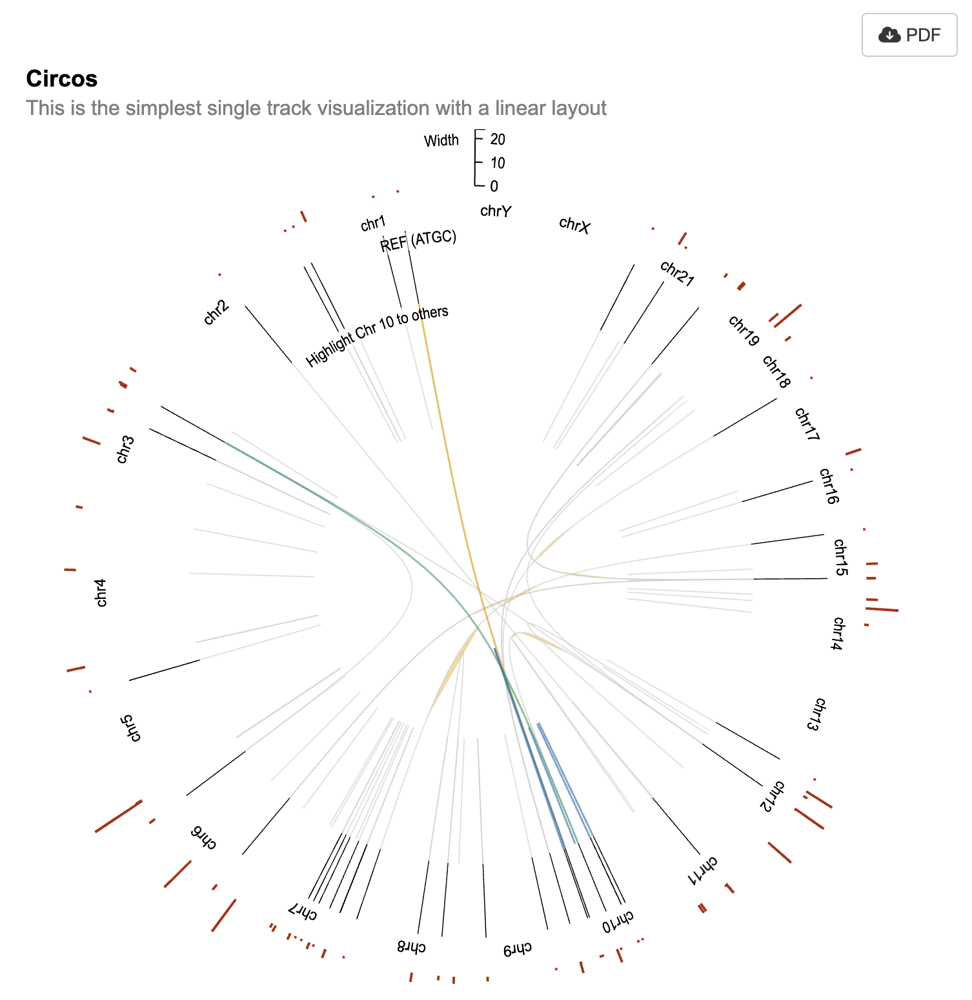

```{r, include=FALSE, eval=FALSE}
knitr::opts_chunk$set(
  collapse = TRUE,
  comment = "#>"
)
```

## Call required libraries. Initialize gosling with `use_gosling()`

```{r setup, eval=FALSE, message=FALSE}
require(StructuralVariantAnnotation)
require(ggbio)
require(shiny)
require(shiny.gosling)
use_gosling()
```

## Loading a VCF data
StructuralVariantAnnotation is built on top of the Bioconductor package VariantAnnotation. VCF files are loaded using VariantAnnotation::readVcf, and converted to breakpoint GRanges notation using breakpointRanges Any non-structural variants such as single nucleotide variants in a VCF will be silently ignored by StructuralVariantAnnotation. More information about VCF objects can be found by consulting the vignettes in the VariantAnnotation package with browseVignettes("VariantAnnotation").

Colo829, is a human cell line primarily derived from skin tissue affected by melanoma, a type of malignant skin cancer. The cell line is maintained and distributed by the American Type Culture Collection (ATCC) under the product name "COLO 829." Its unique identifier is Catalog Number CRL-1974.

The Colo829 cell line was established from a 45-year-old male patient with melanoma, making it an important resource for research and study of this particular disease. The cells are preserved in a frozen state, allowing for long-term storage and viability.

These cells are classified as fibroblast-like, which indicates their morphological and functional characteristics are similar to fibroblasts, a type of connective tissue cell involved in wound healing and extracellular matrix production.

With a Biosafety Level of 1, Colo829 is considered safe to handle and work with under standard laboratory conditions. This makes it accessible to a wider range of researchers and laboratories.

The primary application of Colo829 is in 3D cell culture experiments, where it can be used to model melanoma or study interactions between cancer cells and their surrounding environment in a more physiologically relevant setting.

Being a human cell line of Homo sapiens origin, Colo829 is a valuable tool for studying human-specific processes and responses. Its tissue origin from the skin makes it particularly relevant for melanoma research, as the disease primarily affects skin cells.

Overall, Colo829 is a well-characterized cell line that holds significance in the field of melanoma research and offers a versatile platform for investigating various aspects of cancer biology and therapeutic development.

See more info about this cell line at https://www.cellosaurus.org/CVCL_1137

```{r reading-data, eval=FALSE}
colo829_vcf <- VariantAnnotation::readVcf(
  system.file(
    "extdata",
    "COLO829T.purple.sv.ann.vcf.gz",
    package = "StructuralVariantAnnotation"
  )
)
colo829_bpgr <- breakpointRanges(colo829_vcf)
```

## Visualizing breakpoint pairs via circos plots

We can visualize breakpoints with a circos plot.

To plot structural variant breakpoints in a circos plot using shiny.gosling, we need to first prepare the breakpoint GRanges. The function requires a special column, indicating the end of the link using GRanges format.

This chunk of code is manipulating genomic ranges represented by the 'granges' object named 'colo829_bpgr' to create a circular visualization layout using the 'biovizBase' package. The goal is to subset the genomic ranges relevant to the human genome version 'hg19sub' and then convert these ranges into a circular layout.

```{r process-data, eval=FALSE}
# In this line, a subset of genomic ranges is extracted from the object
# colo829_bpgr. The subset is obtained by filtering based on the sequence
# names (seqnames) present in colo829_bpgr that are also found in the
# sequence levels (seqlevels) of the hg19sub reference genome from the
# biovizBase package. colo829_bpgr is assumed to be a GenomicRanges object
# containing genomic regions.
gr_circos <- colo829_bpgr[seqnames(colo829_bpgr) %in% seqlevels(biovizBase::hg19sub)]

# This line updates the sequence levels of the gr_circos object to match
# those of the hg19sub reference genome. It ensures that the genomic ranges
# in gr_circos align properly with the reference genome.
seqlevels(gr_circos) <- seqlevels(biovizBase::hg19sub)

# Here, the metadata columns (mcols) of the gr_circos object are updated
# with additional information. Specifically, a new column called "to.gr" is
# added, and its values are assigned using the granges function on the
# partner genomic ranges of gr_circos.
mcols(gr_circos)$to.gr <- granges(partner(gr_circos))
```


## Using the GRanges object for a circos plot using shiny.gosling

### Setup Tracks

#### Track 1

We will have 3 tracks in this circos plot. The outermost layer displays the width of a sequence as a bar plot in maroon.

In the track below, we first give it an `id`. 
In the following line, we assign a title to it. This title will be displayed at the top of the rings.
Next, we prepare and pass the data with `track_data_gr`, which takes the GRanges object, the chromosome field names and the genomic field names.
We set the mark to `bar` as we need a simple bar plot here.
We define x and y via `visual_channel_x` and `visual_channel_y`.
Finally, we set the color of the bar plot and the width & height.

```{r track-1, eval=FALSE}

track1 <- add_single_track(
  id = "track1",
  title = "Quality",
  data = track_data_gr(
    gr_circos, chromosomeField = "seqnames",
    genomicFields = c("start", "end")
  ),
  mark = "bar",
  x = visual_channel_x(field = "start", type = "genomic", axis = "bottom"),
  y = visual_channel_y(field = "QUAL", type = "quantitative", axis = "right"),
  color = visual_channel_color(
    value = "#BB3114"
  ),
  width = 700,
  height = 100
)
```

#### Track 2

The middle layer plots the start of the sequence to its end.

In this layer, we begin similarly by setting the id and the title of the layer.
Next we pass the same data object as our data will not change. But other data can be used here. We just need to pass the appropriate `chromosomeField` and `genomicFields`.
We set this as `mark = "rect"` as we want to fill the ring with a color if data is a certain value. These are called ideograms.
We set the `strokeWidth` to 0.5.
We set the stroke itself to have different colors based on the value in the `field` argument. Since "REF" is passed as field, and it has 4 values: A, C, G and T, we set the domain and range accordingly. A corresponds to color `#73A97D` and so on.
Finally, we set the `x` and `xe`. Since this is a `rect` ( rectangle ) plot, it only has `x` and `xe` and no `y`.

```{r track-2, eval=FALSE}

track2 <- add_single_track(
  id = "track2",
  title = "REF",
  data = track_data_gr(
    gr_circos, chromosomeField = "seqnames",
    genomicFields = c("start", "end")
  ),
  mark = "rect",
  strokeWidth = visual_channel_stroke_width(
    value = 0.5
  ),
  stroke = visual_channel_stroke(
    field = "REF",
    type = "nominal",
    domain = list("A", "C", "G", "T"),
    range = list("#73A97D", "#C1BB78", "#1F5E89", "#CF784B")
  ),
  x = visual_channel_x(field = "start", type = "genomic"),
  xe = visual_channel_x(field = "end", type = "genomic"),
  width = 700,
  height = 100
)
```

#### Track 3

Finally, the innermost layer shows the changes in sequences.

For the last layer, we start off again by setting the id and the title.
We set the data with `track_data_gr` but we now set the `chromosomeField` and `genomicFields` to `to.gr` columns. We also set `longToWideId`. This will spread the data based on `event` column. So the new data will have double the number of columns and will have a new column for every existing column with the suffix `_2`. So `to.gr.start` will have a corresponding column `to.gr.start_2` added to the DB. This is essentially widening the dataset.
We set alignment to overlay, as we want the tracks to be plotted on top of each other.
We then add 2 sub-tracks to this track. The sub-tracks inherits all the data from the parent track. These tracks are set with `mark = "withinLink"` so that the 2 tracks are linked with each other. And we set `x`, `xe`, `x1` and `x1e` to refer to the correct columns in the data. The first sub-track traces all variations that are not a part of `ch10` and the second sub-track traces the ones that are a part of `ch10`. The first sub-track will trace on gray color and the second sub-track will trace in various colors based on its sequence name.
In the end we also specify the width, height and the stroke width.

```{r track-3, eval=FALSE}

track3 <- add_single_track(
  id = "track3",
  title = "Highlight similarities of Chr 10 with others",
  data = track_data_gr(
    gr_circos, chromosomeField = "to.gr.seqnames",
    genomicFields = c("to.gr.start", "to.gr.end"),
    longToWideId = "event"
  ),
  alignment = "overlay",
  opacity = visual_channel_opacity(
    value = 0.4
  ),
  tracks = add_multi_tracks(
    add_single_track(
      dataTransform = track_data_transform(
        type = "filter", field = "to.gr.seqnames", oneOf = list("10"), not = TRUE
      ),
      mark = "withinLink",
      x = visual_channel_x(
        field = "to.gr.start", type = "genomic"
      ),
      xe = visual_channel_x(
        field = "to.gr.start_2", type = "genomic"
      ),
      x1 = visual_channel_x(
        field = "to.gr.end", type = "genomic"
      ),
      x1e = visual_channel_x(
        field = "to.gr.end_2", type = "genomic"
      ),
      stroke = visual_channel_stroke(
        value = "lightgray"
      ),
      strokeWidth = visual_channel_stroke_width(
        value = 1
      )
    ),
    add_single_track(
      dataTransform = track_data_transform(
        type = "filter", field = "to.gr.seqnames", oneOf = list("10")
      ),
      mark = "withinLink",
      x = visual_channel_x(
        field = "to.gr.start", type = "genomic"
      ),
      xe = visual_channel_x(
        field = "to.gr.start_2", type = "genomic"
      ),
      x1 = visual_channel_x(
        field = "to.gr.end", type = "genomic"
      ),
      x1e = visual_channel_x(
        field = "to.gr.end_2", type = "genomic"
      ),
      stroke = visual_channel_stroke(
        field = "to.gr.seqnames_2",
        type = "nominal",
        range = c(
          "#E79F00", "#029F73", "#0072B2", "#CB7AA7", "#D45E00",
          "#57B4E9", "#EFE441"
        )
      ),
      strokeWidth = visual_channel_stroke_width(
        value = 1.5
      )
    )
  ),
  width = 700,
  height = 200
)
```

#### Final View

Finally we put all the 3 main tracks together along with some parameters to control the layout style, the alignment and so on.

```{r single_composed_track, eval=FALSE}

single_composed_track <- compose_view(
  title = "Circos",
  subtitle = "http://circos.ca/intro/genomic_data/",
  layout = "circular",
  static = TRUE,
  spacing = 1,
  centerRadius = 0.3,
  alignment = "stack",
  multi = TRUE,
  tracks = add_multi_tracks(track1, track2, track3)
)
```

#### Run App

We put all of this in a shiny app.

```{r run_app, eval=FALSE}

ui <- fluidPage(
  use_gosling(),
  fluidRow(
    column(6, goslingOutput("gosling_plot")),
    column(
      1, br(), actionButton(
        "download_pdf",
        "PDF",
        icon = icon("cloud-arrow-down")
      )
    )
  )
)

server <- function(input, output, session) {
  output$gosling_plot <- renderGosling({
    gosling(
      component_id = "component_1",
      single_composed_track
    )
  })

  observeEvent(input$download_pdf, {
    export_pdf(component_id = "component_1")
  })
}

shinyApp(ui, server)
```

{width=500px}

## Session Info

```{r session_info}

sessionInfo()
```
