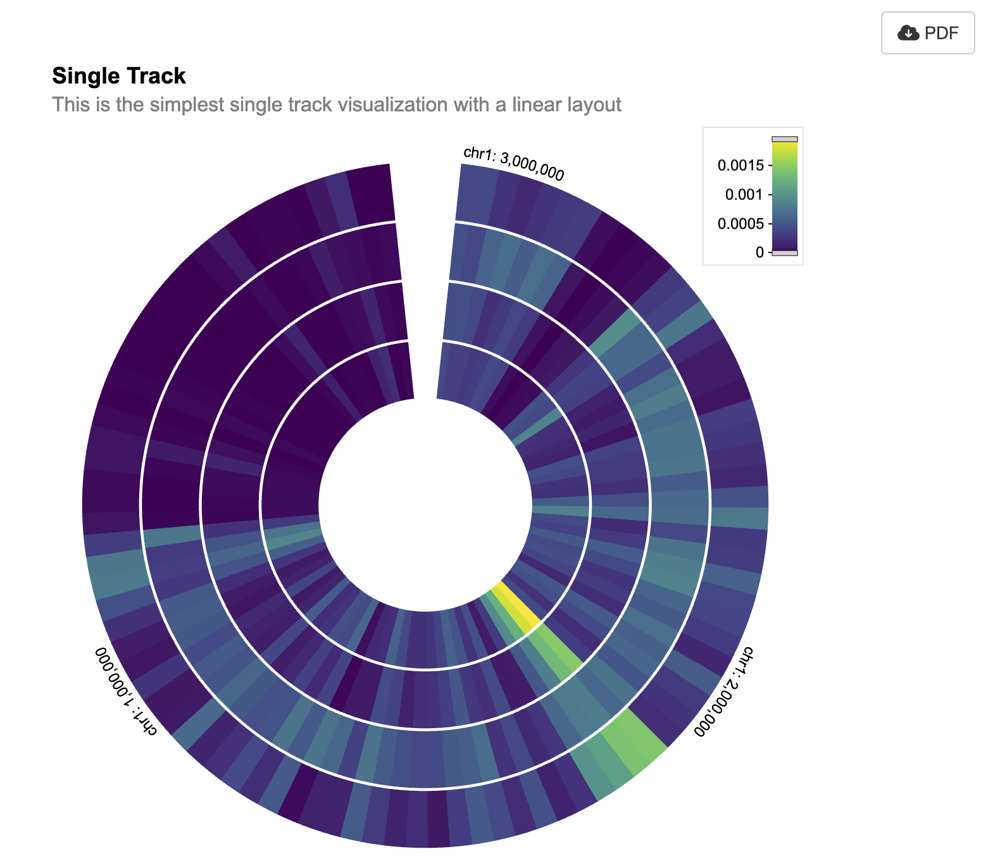

```{r, include=FALSE, eval=FALSE}
knitr::opts_chunk$set(
  collapse = TRUE,
  comment = "#>"
)
```

This is a Shiny app written in R that creates an interactive visualization using the shiny and shiny.gosling packages. The visualization displays genomic data from the Cistrome database in a track-based layout.

## Call required libraries.

```{r setup, message=FALSE, eval=FALSE}
require(shiny)
require(shiny.gosling)
```

## Loading the url to a multivec dataset

The variable cistrome_data contains a URL pointing to a dataset in the Cistrome database, which is a multivec data source.

"Multivec" is a term used in genomics to refer to a specific type of data format used for representing and visualizing multi-dimensional numerical data across genomic coordinates. It's commonly used for representing data like ChIP-seq, ATAC-seq, Hi-C, and other genomic experiments where signals or measurements are collected at various genomic positions.

Multivec data is essentially a matrix where rows correspond to different genomic positions or regions, and columns correspond to different samples or experiments. Each entry in the matrix represents a value associated with a specific genomic position and sample. The genomic positions along the rows of the matrix are usually represented as chromosomal coordinates (chromosome name and base pair position). This allows the data to be aligned with the genome, enabling accurate visualization and analysis. There are different tools and file formats that support multivec data, allowing researchers to work with and visualize this type of data. The bigWig and bedGraph formats are commonly used for representing multivec data. Visualization tools and libraries like the UCSC Genome Browser, IGV (Integrative Genomics Viewer), and libraries like "shiny.gosling" can render multivec data visualizations.

```{r, reading-data, eval=FALSE}
cistrome_data <-
  "https://server.gosling-lang.org/api/v1/tileset_info/?d=cistrome-multivec"
```

## Creating a Single Track

The add_single_track function is used to create a single track visualization.
The track_data function is used to define the data source for the track. It specifies the URL of the dataset, the type of data ("multivec"), and various data-related parameters such as rows, columns, values, categories, and bin size.
The visualization of the track is specified using various visual channels such as x, xe, row, color, and tooltip.

```{r single_track, eval=FALSE}

single_track <- add_single_track(
  id = "track1",
  data = track_data(
    url = cistrome_data,
    type = "multivec",
    row = "sample",
    column = "position",
    value = "peak",
    categories = c("sample 1", "sample 2", "sample 3", "sample 4"),
    binSize = 4,
  ),
  mark = "rect",
  x = visual_channel_x(field = "start", type = "genomic", axis = "top"),
  xe = visual_channel_x(field = "end", type = "genomic"),
  row = visual_channel_row(
    field = "sample",
    type = "nominal",
    legend = TRUE
  ),
  color = visual_channel_color(
    field = "peak",
    type = "quantitative",
    legend = TRUE
  ),
  tooltip = visual_channel_tooltips(
    visual_channel_tooltip(field = "start", type = "genomic",
                           alt = "Start Position"),
    visual_channel_tooltip(field = "end", type = "genomic",
                           alt = "End Position"),
    visual_channel_tooltip(
      field = "peak",
      type = "quantitative",
      alt = "Value",
      format = "0.2"
    )
  ),
  width = 600,
  height = 130
)
```

## Composing the track

The compose_view function is used to compose the single track visualization into a view.
The composed view is placed within a circular layout.
The x-domain (genomic interval) is set to chromosome 1, interval [1, 3000500].

```{r, compose, eval=FALSE}
single_composed_track <- compose_view(
  tracks = single_track
)

single_composed_views <- arrange_views(
  title = "Single Track",
  subtitle = "This is the simplest single track visualization with a linear layout",
  layout = "circular", #"linear"
  views = single_composed_track,
  xDomain = list(
    chromosome = "chr1",
    interval = c(1, 3000500)
  )
)
```

## Shiny App ui

The use_gosling function is used to incorporate the shiny.gosling package for rendering the visualization.

```{r, ui, eval=FALSE}
ui <- fluidPage(
  use_gosling(),
  fluidRow(
    column(6, goslingOutput("gosling_plot")),
    column(
      1, br(), actionButton(
        "download_pdf",
        "PDF",
        icon = icon("cloud-arrow-down")
      )
    )
  )
)
```

## Shiny App server

The renderGosling function is used to render the visualization using the gosling function, passing in the composed view.

```{r, server, eval=FALSE}
server <- function(input, output, session) {
  output$gosling_plot <- renderGosling({
    gosling(
      component_id = "component_1",
      single_composed_views,
      clean_braces = TRUE
    )
  })

  observeEvent(input$download_pdf, {
    export_pdf(component_id = "component_1")
  })
}

shinyApp(ui, server)
```

{width=500px}

## Session Info

```{r session_info}

sessionInfo()
```
