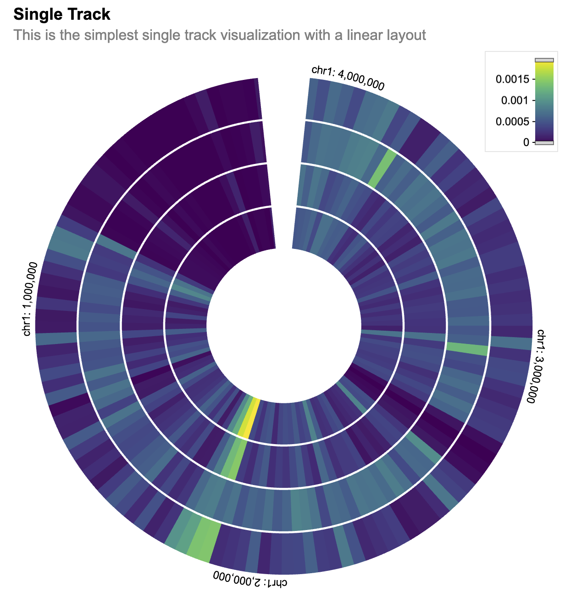

```{r, include = FALSE}
knitr::opts_chunk$set(
  collapse = TRUE,
  comment = "#>"
)
```

This is a Shiny app written in R that creates an interactive visualization using the shiny and shiny.gosling packages. The visualization displays genomic data from the Cistrome database in a track-based layout.

## Call libraryd libraries.

```{r setup, message=FALSE, eval=FALSE}
library(shiny.gosling)
library(shiny)
library(sessioninfo)
```

## Introduction to shiny.gosling

This package is an R shiny implementation of the [**Gosling.js**](http://gosling-lang.org/) library. Gosling js is a highly *expressive* library based on a *Grammar for scalable and interactive Genomics Data visualization*. This library is build upon the [**React** wrapper of the Gosling.js](https://github.com/gosling-lang/gosling-react). Which is powered by [**Shiny.React**](https://github.com/gosling-lang/gosling-react). Thus most of the Charts can be directly build using this package.

Let's start with an example. For that let's read a csv file which has some Genomic data with chromosome start stop indicators. This dataset is directly picked from gosling-lang.org [here](https://server.gosling-lang.org/api/v1/tileset_info/?d=cistrome-multivec).

[Multivec](https://docs.higlass.io/data_preparation.html#multivec-files) is a file format introduced by [Higlass](https://higlass.io/) suitable for representing and visualizing multi-dimensional numerical data across genomic coordinates. It's commonly used for representing data like ChIP-seq, ATAC-seq, Hi-C, and other genomic experiments where signals or measurements are collected at various genomic positions.

Multivec data is essentially a matrix where rows correspond to different genomic positions or regions, and columns correspond to different samples or experiments. Each entry in the matrix represents a value associated with a specific genomic position and sample. The genomic positions along the rows of the matrix are usually represented as chromosomal coordinates (chromosome name and base pair position). This allows the data to be aligned with the genome, enabling accurate visualization and analysis. There are different tools and file formats that support multivec data, allowing researchers to work with and visualize this type of data. The bigWig and bedGraph formats are commonly used for representing multivec data. Visualization tools and libraries like the UCSC Genome Browser, IGV (Integrative Genomics Viewer), and libraries like "shiny.gosling" can render multivec data visualizations.

Here are some resources and links where you can learn more about multivec data and how it's used in genomics research:

UCSC Genome Browser:

The UCSC Genome Browser is a widely used tool for visualizing genomic data, including multivec data.
[Tutorial on visualizing multivec data in the UCSC Genome Browser](https://genome.ucsc.edu/training/)

IGV (Integrative Genomics Viewer):

IGV is another popular genome visualization tool that supports multivec data.
[Tutorial on loading and visualizing multivec data in IGV](https://www.youtube.com/watch?v=P9n0tZxiwPs)

BedGraph and BigWig Formats:

These are common file formats used for representing multivec data.
[Explanation of the BedGraph format](https://genome.ucsc.edu/goldenPath/help/bedgraph.html)
[Explanation of the BigWig format](https://genome.ucsc.edu/goldenPath/help/bigWig.html)

```{r store-data-links, eval=FALSE}

cistrome_data <- "https://server.gosling-lang.org/api/v1/tileset_info/?d=cistrome-multivec"
```

In shiny.gosling we can basically create tracks from data and then create view from tracks. To understand how to build a plot let's understand 3 basic principles of `gosling.js`

1.  `Track` contains data, layout, height, width and all aesthetics etc...
2.  One or more Track combine together create a `View`
3.  One or more views combine together create a `Plot`.

This is how a plot is created in Gosling. Let's visit this one by one.

Let's start by creating a track. Let's define the first track and add more properties to the track. With `shiny.gosling` you can be specific about the colors and ranges and channel.

Let's build the layers for the plot. So we can build multiple tracks to represent the genome. `add_single_track` function constructs a single track from the inputs.

The track_data function is used to define the data source for the track. It specifies the URL of the dataset, the type of data ("multivec"), and various data-related parameters such as rows, columns, values, categories, and bin size.

The visualization of the track is specified using various visual channels such as x, xe, row, color, and tooltip.

```{r setup-track, eval=FALSE}
single_track <- add_single_track(
  id = "track1",
  data = track_data(
    url = cistrome_data,
    type = "multivec",
    row = "sample",
    column = "position",
    value = "peak",
    categories = c("sample 1", "sample 2", "sample 3", "sample 4"),
    binSize = 4,
  ),
  mark = "rect",
  x = visual_channel_x(field = "start", type = "genomic", axis = "top"),
  xe = visual_channel_x(field = "end", type = "genomic"),
  row = visual_channel_row(
    field = "sample",
    type = "nominal",
    legend = TRUE
  ),
  color = visual_channel_color(
    field = "peak",
    type = "quantitative",
    legend = TRUE
  ),
  tooltip = visual_channel_tooltips(
    visual_channel_tooltip(field = "start", type = "genomic", alt = "Start Position"),
    visual_channel_tooltip(field = "end", type = "genomic", alt = "End Position"),
    visual_channel_tooltip(
      field = "peak",
      type = "quantitative",
      alt = "Value",
      format = "0.2"
    )
  ),
  width = 600,
  height = 130
)

```

The compose_view function is used to compose the single track visualization into a view.
The composed view is placed within a circular layout.
The x-domain (genomic interval) is set to chromosome 1, interval [1, 3000500].

```{r compose-track, eval=FALSE}
single_composed_track <- compose_view(
  tracks = single_track
)
```

```{r final-view, eval=FALSE}
single_composed_views <- arrange_views(
  title = "Single Track",
  subtitle = "This is the simplest single track visualization with a linear layout",
  layout = "circular",
  views = single_composed_track,
  xDomain = list(
    chromosome = "chr1",
    interval = c(1, 3000500)
  )
)

```

We can then even add more tracks to it. So let's create a few more tracks just to make a better and more beautiful graph.

The use_gosling function is used to incorporate the shiny.gosling package for rendering the visualization.

Hovering on the plot will show the start position, the end position and the value.

Scrolling on the plot, will zoom in or zoom out the view.

Users can click on the PDF button to download a pdf of the current state of the plot.

```{r run-app, eval=FALSE, eval=FALSE}

server <- function(input, output, session) {

  output$gosling_plot <- renderGosling({
    gosling(
      component_id = "component_1",
      single_composed_views,
      clean_braces = TRUE
    )
  })
}

ui <- fluidPage(
  use_gosling(),
  goslingOutput("gosling_plot")
)


shiny::shinyApp(ui, server, options = list(height = 700))
```

{width=500px}

## Session Info

```{r, session_info}

sessionInfo()
```
