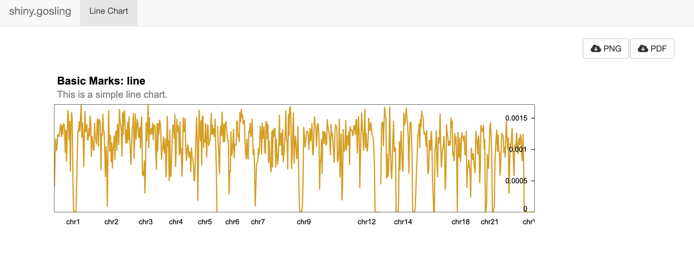

```{r, include=FALSE, eval=FALSE}
knitr::opts_chunk$set(
  collapse = TRUE,
  comment = "#>"
)
```

In this tutorial, we'll explore how to create an interactive line chart visualization of genomic data using the shiny and shiny.gosling packages in R. This visualization will enable users to explore trends and patterns within genomic datasets.

## Introduction

The shiny and shiny.gosling packages offer powerful tools for building interactive data visualizations within Shiny apps. In this tutorial, we'll demonstrate the process of constructing an interactive line chart visualization using genomic data. This example leverages the shiny package for user interface design and the shiny.gosling package for generating the visualizations.

## Understanding Multivec Data

[Multivec](https://docs.higlass.io/data_preparation.html#multivec-files) is a file format introduced by [Higlass](https://higlass.io/) suitable for visualizing multi-dimensional numerical data across genomic coordinates. It's widely utilized for representing various genomic experiments such as ChIP-seq, ATAC-seq, and Hi-C, where measurements are taken at different genomic positions.

Multivec data is essentially a matrix where rows correspond to genomic positions or regions, and columns correspond to different samples or experiments. Each matrix entry represents a value associated with a specific genomic position and sample. The genomic positions are typically represented as chromosomal coordinates (chromosome name and base pair position), allowing accurate alignment with the genome. Tools like the UCSC Genome Browser, IGV, and libraries like shiny.gosling can visualize multivec data effectively.

To delve deeper into multivec data and its application in genomics, explore these resources:

[UCSC Genome Browser](https://genome.ucsc.edu/cgi-bin/hgGateway): A versatile tool for visualizing genomic data, including multivec data. Learn how to visualize multivec data in the UCSC Genome Browser.

[Integrative Genomics Viewer (IGV)](https://software.broadinstitute.org/software/igv/): Another popular genome visualization tool supporting multivec data. Discover how to load and visualize multivec data in IGV.

[BedGraph and BigWig Formats](https://genome.ucsc.edu/goldenPath/help/bigWig.html): These common formats are used to represent multivec data. Explore explanations of the BedGraph and BigWig formats.

## Call libraryd libraries.

```{r setup, message=FALSE, eval=FALSE}
library(shiny)
library(shiny.gosling)
```

## Creating the Data Object

We'll begin by fetching the multivec data using the track_data function. This function retrieves data from a specified URL, where the data is organized as a matrix with rows representing samples and columns representing positions. We'll define the row, column, and value attributes along with the sample categories. The categories parameter should contain a list of category names (e.g., "sample 1").

```{r, reading-data, eval=FALSE}

# Create data object ----
view1_data <- track_data(
  url = "https://resgen.io/api/v1/tileset_info/?d=UvVPeLHuRDiYA3qwFlm7xQ",
  type = "multivec",
  row = "sample",
  column = "position",
  value = "peak",
  categories = list("sample 1")
)
```

## Constructing the Line Chart Track

To visualize the data, we'll define the visual channels for the line chart. We'll specify that the x-axis should represent genomic positions and the y-axis should represent peak values. The add_single_track function creates a line chart visualization using these visual channels. Additionally, we'll set the width and height of the plot and specify the data source.

```{r single_track, eval=FALSE}

# Create visual channels ----
view1_x <- visual_channel_x(
  field = "position", type = "genomic", axis = "bottom"
)

view1_y <- visual_channel_y(
  field = "peak", type = "quantitative", axis = "right"
)

# Create single track ----
single_track <- add_single_track(
  width = 800,
  height = 180,
  data = view1_data,
  mark = "line",
  x = view1_x,
  y = view1_y,
  size = visual_channel_size(
    value = 2
  )
)
```

## Composing and Arranging the View

The compose_view function is used to create a composed view that contains the single line chart track.
The layout of the view is specified as "linear".

The arrange_views function arranges the composed view created earlier.
The title and subtitle for the arrangement are specified.
The arranged view is named single_composed_views.

```{r, compose, eval=FALSE}

# Compose the track ----
single_composed_view <- compose_view(
  tracks = single_track,
  layout = "linear"
)

# Arrange the view above ----
single_composed_views <- arrange_views(
  title = "Basic Marks: line",
  subtitle = "This is a simple line chart.",
  views = single_composed_view
)
```

## Shiny App ui

The navbarPage function creates a navigation bar at the top of the user interface.
Within the navigation bar, there is a single tab panel named "Line Chart."
Inside the tab panel, the use_gosling function is used to incorporate the shiny.gosling package.
The fluidPage function is used to create a fluid layout within the tab panel.
Two columns are defined: one for the goslingOutput and another for action buttons.

```{r, ui, eval=FALSE}

ui <- navbarPage(
  title = "shiny.gosling",
  tabPanel(
    "Line Chart",
    use_gosling(),
    fluidPage(
      width = 12,
      fluidRow(
        column(
          width = 8,
          goslingOutput("gosling_plot_test")
        ),
        column(
          width = 4,
          fluidRow(
            column(
              2,
              actionButton(
                "download_png",
                "PNG",
                icon = icon("cloud-arrow-down")
              )
            ),
            column(
              2,
              actionButton(
                "download_pdf",
                "PDF",
                icon = icon("cloud-arrow-down")
              )
            )
          )
        )
      )
    )
  )
)
```

## Shiny App server

The server logic is defined using the server function.
The observeEvent functions are used to respond to button clicks and user interactions.
Clicking the "PNG" or "PDF" buttons triggers the respective download action for the visualization.
The output$gosling_plot_test function uses renderGosling to render the composed view using the gosling function from the shiny.gosling package.

```{r, server, eval=FALSE}

server <- function(input, output, session) {

  observeEvent(input$download_png, {
    export_png(component_id = "sars_cov2")
  })

  observeEvent(input$download_pdf, {
    export_pdf(component_id = "sars_cov2")
  })

  observeEvent(input$zoom_out, {
    zoom_to_extent(
      component_id = "sars_cov2",
      view_id = "view2_track1"
    )
  })

  output$gosling_plot_test <- renderGosling({
    gosling(
      component_id = "sars_cov2",
      single_composed_views,
      clean_braces = TRUE
    )
  })
}

shinyApp(ui, server)
```

{width=500px}

## Session Info

```{r session_info}

sessionInfo()
```
