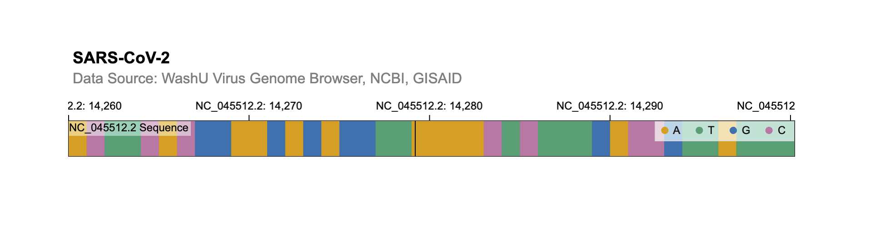

```{r, include=FALSE}
knitr::opts_chunk$set(
  collapse = TRUE,
  comment = "#>"
)
```

This is an example of how to create an interactive genomic visualization using the shiny.gosling package within a Shiny app. It leverages the shiny package for creating the user interface and interactivity.

We create a Shiny app that visualizes genomic data using the shiny.gosling package. It generates an interactive visualization with tracks displaying DNA base counts and annotations, allowing users to explore genomic data related to the SARS-CoV-2 virus.

## Call library libraries

```{r setup, message=FALSE, results="hide"}
library(shiny)
library(shiny.gosling)
```

## Fetching Data

Below, we use the track_data() function to fetch data from the specified URL. The data represents base counts for the SARS-CoV-2 virus genome, organized into rows and columns. It includes attributes like base, position, count, and categories (A, T, G, C).

"Multivec" is a term used in genomics to refer to a specific type of data format used for representing and visualizing multi-dimensional numerical data across genomic coordinates. It's commonly used for representing data like ChIP-seq, ATAC-seq, Hi-C, and other genomic experiments where signals or measurements are collected at various genomic positions.

Multivec data is essentially a matrix where rows correspond to different genomic positions or regions, and columns correspond to different samples or experiments. Each entry in the matrix represents a value associated with a specific genomic position and sample. The genomic positions along the rows of the matrix are usually represented as chromosomal coordinates (chromosome name and base pair position). This allows the data to be aligned with the genome, enabling accurate visualization and analysis. There are different tools and file formats that support multivec data, allowing researchers to work with and visualize this type of data. The bigWig and bedGraph formats are commonly used for representing multivec data. Visualization tools and libraries like the UCSC Genome Browser, IGV (Integrative Genomics Viewer), and libraries like "shiny.gosling" can render multivec data visualizations.

Here are some resources and links where you can learn more about multivec data and how it's used in genomics research:

UCSC Genome Browser:

The UCSC Genome Browser is a widely used tool for visualizing genomic data, including multivec data.
[Tutorial on visualizing multivec data in the UCSC Genome Browser](https://genome.ucsc.edu/goldenPath/help/bigWig.html)

IGV (Integrative Genomics Viewer):

IGV is another popular genome visualization tool that supports multivec data.
[Tutorial on loading and visualizing multivec data in IGV](https://igv.org/doc/desktop/)

BedGraph and BigWig Formats:

These are common file formats used for representing multivec data.
[Explanation of the BedGraph format](https://genome.ucsc.edu/goldenPath/help/bedgraph.html)
[Explanation of the BigWig format](https://genome.ucsc.edu/goldenPath/help/bigWig.html)

```{r, reading-data}

track1_data <- track_data(
  url = "https://server.gosling-lang.org/api/v1/tileset_info/?d=NC_045512_2-multivec",
  type = "multivec",
  row = "base",
  column = "position",
  value = "count",
  categories = c("A", "T", "G", "C"),
  start = "start",
  end = "end"
)
```

## Creating Tracks

Here, we define two tracks (track1 and track2) that will be displayed in the visualization. track1 displays the count of DNA bases using a bar mark, and track2 displays text annotations for certain conditions.

```{r single_track}

track1 <- add_single_track(
  mark = "bar",
  y = visual_channel_y(
    field = "count", type = "quantitative", axis = "none"
  )
)

track2 <- add_single_track(
  dataTransform = track_data_transform(
    type = "filter",
    field = "count",
    oneOf = list(0),
    not = TRUE
  ),
  mark = "text",
  x = visual_channel_x(
    field = "start", type = "genomic"
  ),
  xe = visual_channel_x(
    field = "end", type = "genomic"
  ),
  size = 24,
  color = "white",
  visibility = list(list(
    operation = "less-than",
    measure = "width",
    threshold = "|xe-x|",
    transitionPadding = 30,
    target = "mark"
  ),
  list(
    operation = "LT",
    measure = "zoomLevel",
    threshold = 40,
    target = "track"
  ))
)
```

## Defining Visual Channels

Now, lets define visual channels for track1. track1_x specifies the genomic position on the x-axis, track1_color assigns colors based on DNA bases, and track1_text specifies text annotations based on DNA bases.

```{r visual_channels}

track1_x <- visual_channel_x(
  field = "position", type = "genomic"
)

track1_color <- visual_channel_color(
  field = "base",
  type = "nominal",
  domain = c("A", "T", "G", "C"),
  legend = TRUE
)

track1_text <- visual_channel_text(
  field = "base", type = "nominal"
)

track1_style <- default_track_styles(
  inlineLegend = TRUE
)
```

## Creating combined track

This code chunk combines the previously defined tracks (track1 and track2) into a single track (track3) and specifies various properties such as title, alignment, data, visual channels, and style.

```{r combined_track}

track3 <- add_single_track(
  title = "NC_045512.2 Sequence",
  alignment = "overlay",
  data = track1_data,
  tracks = add_multi_tracks(
    track1, track2
  ),
  x = track1_x,
  color = track1_color,
  text = track1_text,
  style = track1_style,
  width = 800, height = 40
)
```

## Creating the view

Lets create a view (view1) that contains the combined track (track3). It specifies properties like multi-view mode, x-axis domain, alignment, and linking.

```{r, compose}

view1 <- compose_view(
  multi = TRUE,
  centerRadius = 0,
  xDomain = list(interval = c(1, 29903)),
  linkingId = "detail",
  alignment = "stack",
  tracks = add_multi_tracks(
    track3
  )
)
```

## Arranging the view

Next, we arrange views using the arrange_views function. It sets the title, subtitle, assembly information, layout, spacing, and includes the previously defined view1.

```{r, arrange}

combined_view <- arrange_views(
  title = "SARS-CoV-2",
  subtitle = "Data Source: WashU Virus Genome Browser, NCBI, GISAID",
  assembly = list(list("NC_045512.2", 29903)),
  layout = "linear",
  spacing = 50,
  views = list(view1),
  listify = FALSE
)
```

## Shiny App

Finally, we define the Shiny user interface (UI) using the fluidPage function. It includes the goslingOutput function to create a placeholder for the visualization.
We also define the Shiny server logic. It uses the renderGosling function to render the interactive visualization using the combined_view defined earlier.

```{r, ui, results="hide"}

ui <- fluidPage(
  use_gosling(),
  fluidRow(
    column(6, goslingOutput("gosling_plot"))
  )
)


server <- function(input, output, session) {
  output$gosling_plot <- renderGosling({
    gosling(
      component_id = "sars_cov2",
      combined_view
    )
  })
}

shinyApp(ui, server)
```

{width=500px}

## Session Info

```{r session_info}

sessionInfo()
```
